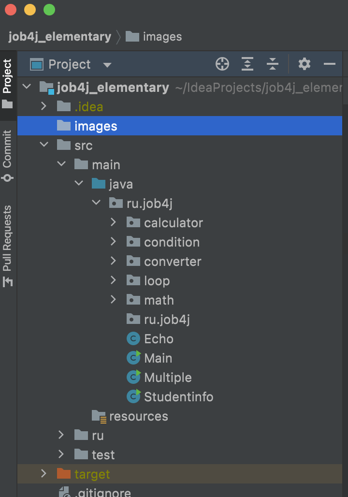

# job4j
Проект содержит решения блока "Базовый синтаксис" курса Job4j.
Проект слыжит для освоения "Базового синтаксиса языка java"
- calculator (типы данных)
- condition (операторы ветвления)
- loop (циклы)
